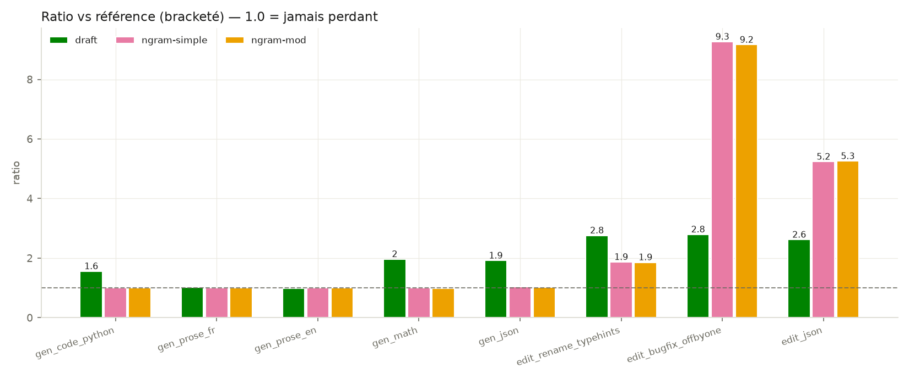

# FRONDE — Turning idle silicon into tokens per second

*Speculative decoding, measured honestly, on a €300 GPU.*


*Illustrative run; all performance claims come from the bracketed batteries.*

## The wall

Generating one token means re-reading every weight. On an RTX 5060 (448 GB/s) running
Qwen3-8B-Q4_K_M (5.03 GB), the ceiling is 448 ÷ 5.03 ≈ **89 tok/s** — and the plain
baseline already hits **80.1 tok/s** (tg128), i.e. 90 % of it, while using **less than
1 % of the GPU's compute**. Prompt processing runs at 3031 tok/s: a **37.8× gap**
between what the silicon can chew and what decoding feeds it.

The whole project is one idea: **produce several tokens per read of the weights.**



## What we measured

All numbers: llama.cpp `b10034` (`505b1ed1`), CUDA 13.1 (sm_120), `-c 4096`,
reasoning disabled, temp 0, seed 42, 3 reps (median), power cap pinned at 145 W, GPU
monitored at 1 Hz. Every comparison is **bracketed** (baseline before + after, ratios
only — thermal drift is real: we measured −11 % over a session on Windows and a −17 %
window on Linux; the brackets kept every ratio honest, max accepted drift 2.6 %).

**Generation** (ratio vs bracketed baseline, ~76–78 tok/s):

| Content | Draft 0.6B (n_max 12, p_min 0.45) | ngram-simple | ngram-mod |
|---|---|---|---|
| Python code | **1.56× (122 tok/s)** | 1.01× | 1.00× |
| French prose | 1.02× | 1.00× | 1.00× |
| English prose | 0.99× | 1.00× | 1.01× |
| Math (step-by-step) | **1.97× (153 tok/s)** | 0.99× | 0.98× |
| JSON | **1.92× (150 tok/s)** | 1.03× | 1.03× |

**Code/JSON editing** (output ≈ copy of the prompt):

| Task | Draft | ngram-simple | ngram-mod (n_match 12) |
|---|---|---|---|
| Rename + type hints (heavy rewrite) | **2.76×** | 1.87× | 1.86× |
| Off-by-one bugfix (near-pure copy) | 2.80× | 9.27× | **9.16× (697 tok/s)** |
| JSON edit (3 changes) | 2.62× | 5.24× | **5.26× (404 tok/s)** |

**Agent loop** — 5 successive edits of the same file on a warm server, stop-at-fence:
ngram-mod finishes in **14.6 s vs 57.3 s** for the baseline (**3.92× wall-clock**),
sustaining **285 tok/s** with peaks at 887 tok/s — ~10× above the naive decoding
ceiling. Both modes emitted the exact same 4169 tokens: speculation never changes
the output (greedy decoding).

## Key findings

1. **The draft model is a bet that pays on structured content.** A 0.6B Q8_0 draft
   nearly doubles math and JSON throughput. The 0.6B alone runs at 407 tok/s vs ~700
   theoretical: it is **kernel-launch-bound**, not bandwidth-bound (which is also why
   a Q4 draft loses to Q8 — smaller weights don't help when launches dominate).
2. **The prose regression died with the platform.** On Windows the draft cost
   ~2.6 ms/token even when silent (−33 % on prose). On Linux + b10034 the worst case
   across every content type is 0.99× — the bet became almost free.
3. **The editing goldmine is real but fragile.** The speedup tracks the copied
   fraction (1.86× on a heavy rewrite → 9.27× on a near-pure copy) — and it silently
   vanishes if the model "thinks" first: chain-of-thought is prose, not copy. One run
   with Qwen3's default thinking enabled cut edits from 5.3× to 1.03×. Capture your
   outputs; an anomalous acceptance rate is a measurement, not a victory.
4. **ngram-simple is the safe floor**: **no material regression in our benchmark
   suite** (≥ 0.99× on every content type measured), no second model, and up to 9.27×
   on edits for free. The stronger *"never below baseline"* phrasing is reserved for
   the **router invariant**, checked by `reproduce.sh` (verdict **PASS**) — not a
   guarantee about every conceivable prompt.
5. **What didn't work:** EAGLE-3 (AngelSlim head for Qwen3-8B) collapsed on a Q4
   target (58 % acceptance on code → 14.8 % on French prose), beaten by the plain
   0.6B draft everywhere. We eliminated quantization, conversion, d2t coverage and
   chat format as causes; the model card itself only claims ~1.7×. Our expectations
   were wrong, not the head.

## FRONDE-Router

A ~250-line client-side dispatcher over llama-server. It doesn't predict which mode
wins — it **measures**: a 48-token probe on the aggressive config, a prompt-hash
cache, epoch batching (one server swap per batch), a static EDIT class (big code/JSON
block + edit verb → ngram-mod, no probe), ngram-simple as the safety floor, and an
EMA collapse detector.

**Invariants** (checked by `reproduce.sh`): ≥ baseline on all 5 content types, and
≥ 90 % of the static champion on code/math/JSON. Current verdict: **PASS** (5/5, and
the router *is* the champion on code, math and JSON). Live routing: prose→safe
(78.6 tok/s), math→aggressive (119.2 tok/s), JSON edit→edit (327.1 tok/s).

**Cold-probe caveat.** The router classifies a novel prompt with a short 48-token
probe on the aggressive config. On that short window a draft model has not yet
amortized its speculation (and right after a server swap GPU clocks are still
ramping), so the probe can measure the aggressive config *below* the plain floor
and conservatively route to `safe` — e.g. plain code, where the draft wins 1.56×
over a full generation but loses on 48 tokens. This never costs throughput: `safe`
(ngram-simple) is ≥ baseline on every content type in our suite, the floor doing its
job. `demo.py` warms
the aggressive server before routing, matching the battery protocol; full-generation
numbers remain the source of every performance claim.

## Reproduce

```bash
./reproduce.sh        # SHA-checks models, builds llama.cpp (CUDA, sm_120), runs the
                      # bracketed benchmark battery, prints the invariant verdict
.venv/bin/python demo.py   # live demo: prose → code → JSON → edit, tok/s counter
```

Hardware: Ryzen 5 5500, RTX 5060 8 GB (145 W cap), 16 GB RAM, Ubuntu 26.04.
Models: Qwen3-8B-Q4_K_M (SHA256 `d98cdcbd…5745785`) + Qwen3-0.6B-Q8_0, from
`Qwen/Qwen3-*-GGUF`. llama.cpp pinned at `b10034` (`505b1ed15ca8…`).

Note for Ubuntu 26.04: CUDA 13.1's `crt/math_functions.h` clashes with glibc's C23
`rsqrt`/`rsqrtf` declarations; `reproduce.sh` documents the two-line header fix.

## Method notes (the hard-earned ones)

- **Bracket everything.** Thermal drift (−11 %/session) will otherwise manufacture
  or hide your effect. Compare ratios, never absolutes.
- **Log watts.** Speculative modes draw ~15 W less than baseline at the same cap —
  efficiency becomes speed whenever there is thermal headroom.
- **Watch VRAM.** Squatted VRAM means silent spill: half the speed, zero errors
  (Windows/WDDM). Linux with `-ngl 99 -c 4096` showed no spill; the harness still
  refuses to run below 6.8 GB free.
- **Capture outputs.** An exploding acceptance rate can measure degeneration (the
  model looping) — or your speedup can silently die to chain-of-thought. Read what
  the model actually wrote.

## Related work

Adaptive and edit-oriented speculative decoding are active research areas. FRONDE's
niche is deliberately narrow: **training-free, lossless (greedy), a single consumer
GPU, routing by *measurement* rather than prediction, and one-command reproduction.**

- **SpecRouter** ([arXiv:2505.07680](https://arxiv.org/abs/2505.07680)) frames inference
  as adaptive routing across *multi-level* chains of draft/verifier models, using
  real-time profiling and predictive similarity to choose a path. FRONDE routes among
  *training-free modes* (one small off-the-shelf draft, or prompt-lookup n-gram) on a
  single 8 GB GPU, and it *measures* a short probe instead of predicting.
- **MetaSD** ([arXiv:2604.05417](https://arxiv.org/abs/2604.05417)) selects among
  multiple trained drafters with alignment feedback, framed as a bandit problem. FRONDE
  uses no trained drafter beyond a stock 0.6B and requires no additional training.
- **EfficientEdit** ([arXiv:2506.02780](https://arxiv.org/abs/2506.02780), ASE 2025)
  targets code editing with an *edit-oriented draft model* plus dynamic verification,
  reporting up to **10.4×–13.1×**. Our edit speedups (up to ~9× on a near-pure copy)
  come from *training-free* prompt-copy n-gram speculation with no extra model — a
  simpler mechanism, and we cite their higher numbers to keep ours in honest context.

## Acknowledgements

*Developed with heavy assistance from Claude Code; experimental design, hardware runs
and release decisions by the maintainer.*

## License

MIT (this repository's code — see `LICENSE`). Third-party components: `THIRD_PARTY_NOTICES.md`.
Model weights (Qwen3, Apache-2.0): `MODEL_LICENSES.md`.

